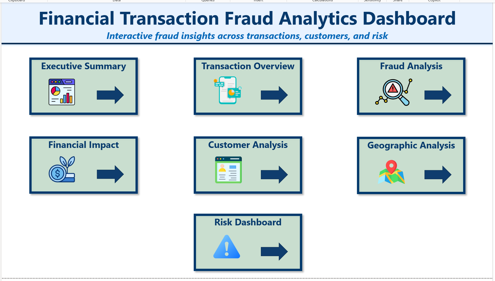
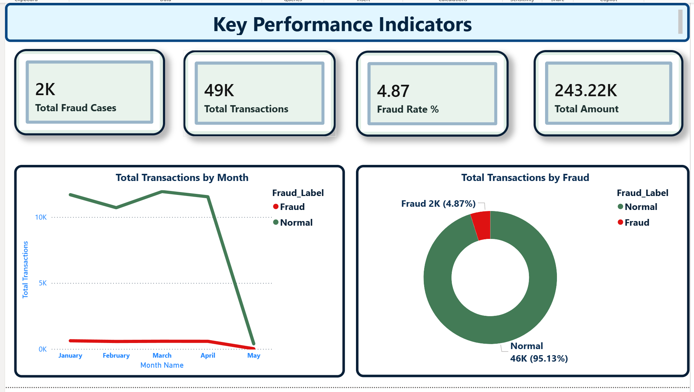
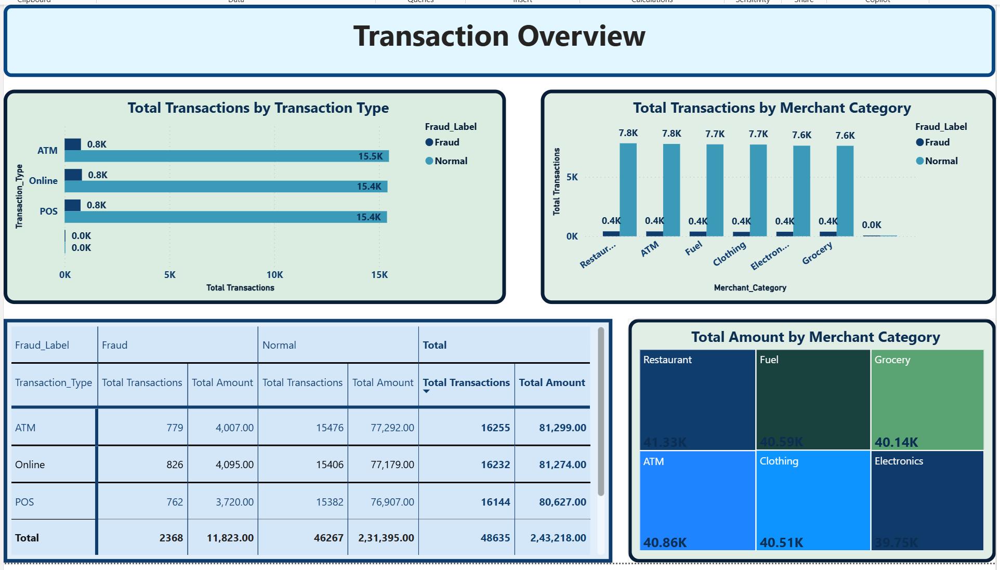
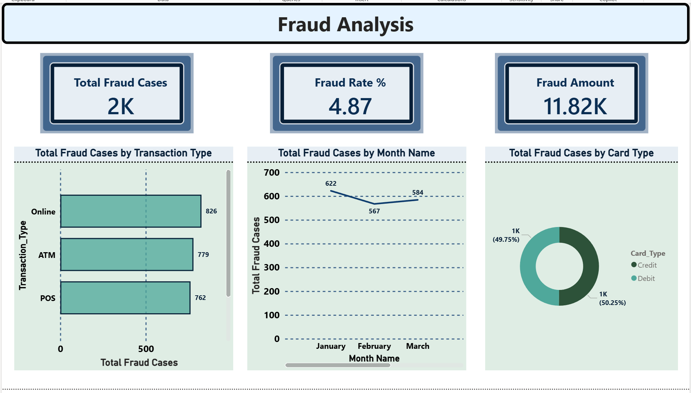
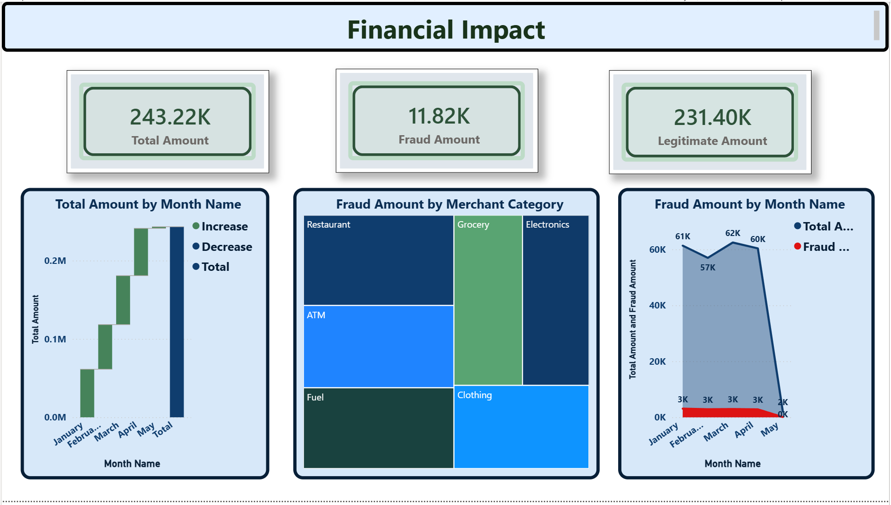
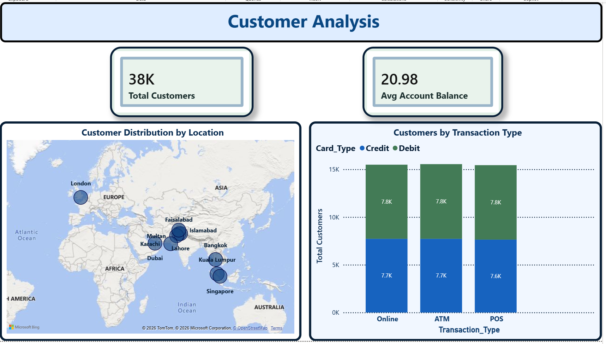
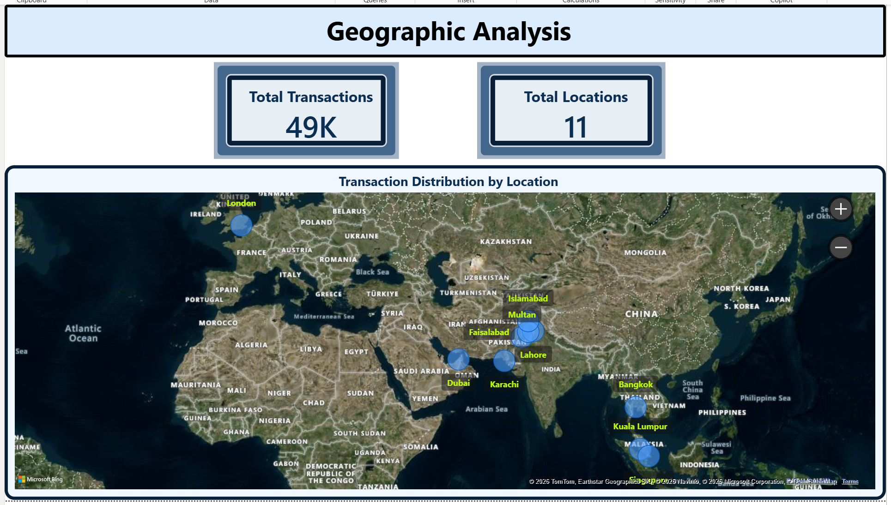
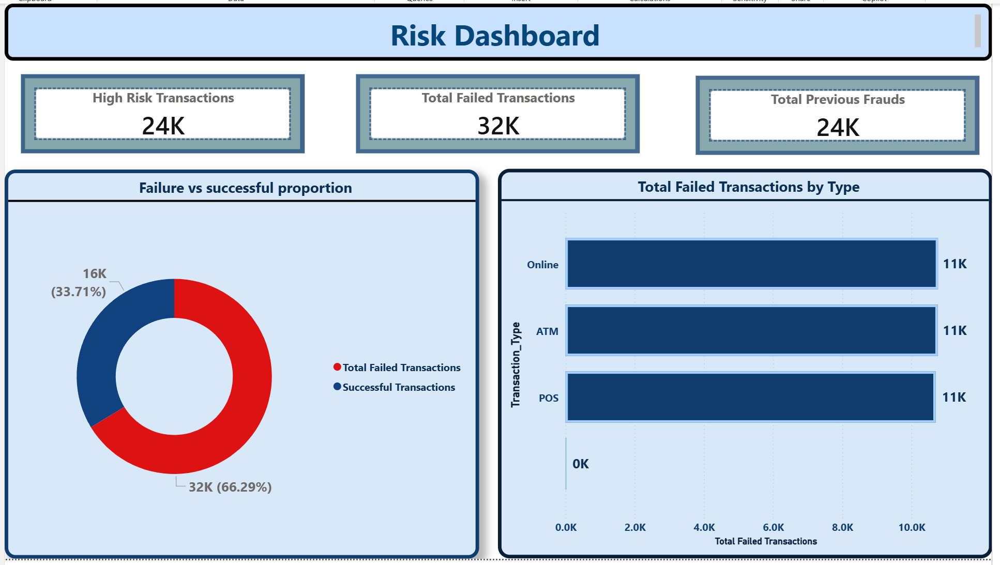
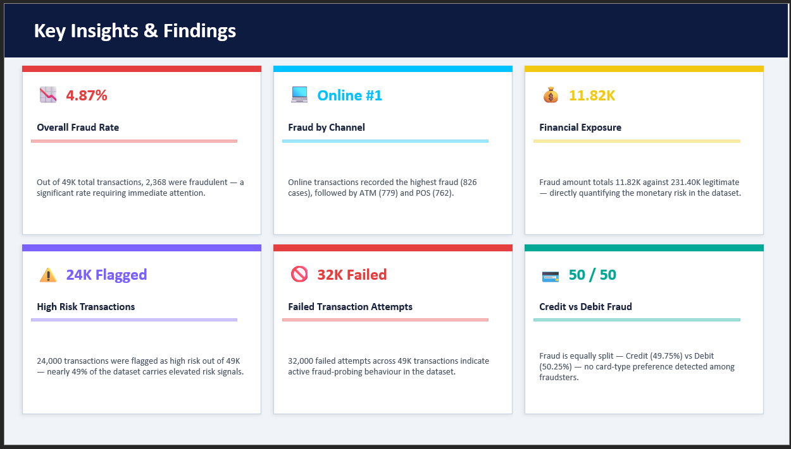

# 💳 Financial Transaction Fraud Analytics Dashboard


> **8-page interactive Power BI dashboard** analyzing 48,635 banking transactions to detect, visualize, and interpret financial fraud across 11 global cities.

---

## 📌 Table of Contents
- [Project Overview](#-project-overview)
- [Key Insights](#-key-insights)
- [Dashboard Pages](#-dashboard-pages)
- [DAX Measures](#-dax-measures)
- [Tools & Technologies](#tools--technologies)
- [Dataset](#-dataset)
- [Screenshots](#-screenshots)
- [Author](#-author)

---

## 🔍 Project Overview

Financial fraud is one of the fastest-growing risks in the banking sector. This project transforms raw transaction data into a **fully interactive Power BI dashboard** that enables fraud analysts and business stakeholders to:

- Detect fraudulent transactions using key risk indicators
- Analyze fraud patterns by channel, geography, and time
- Quantify financial exposure from fraud activity
- Monitor high-risk and failed transaction behaviour
- Make data-driven decisions to reduce fraud losses

---

## 🔑 Key Insights

| # | Metric | Value | Insight |
|---|--------|-------|---------|
| 1 | **Overall Fraud Rate** | 4.87% | 2,368 fraudulent out of 49K transactions |
| 2 | **Highest Fraud Channel** | Online | Online (826) > ATM (779) > POS (762) |
| 3 | **Financial Exposure** | 11.82K | Fraud amount vs 231.40K legitimate |
| 4 | **High Risk Transactions** | 24K Flagged | Nearly 49% of dataset carries risk signals |
| 5 | **Failed Transactions** | 32K | Active fraud-probing behaviour detected |
| 6 | **Card Type Split** | 50 / 50 | Credit 49.75% vs Debit 50.25% — no preference |

---

## 📄 Dashboard Pages

| Page | Title | Description |
|------|-------|-------------|
| 1 | 🏠 Home | Navigation hub with links to all dashboard pages |
| 2 | 📊 Executive Summary | Top-level KPIs — Total Transactions, Fraud Rate, Total Amount |
| 3 | 📋 Transaction Overview | Volume, amounts, and merchant category breakdown |
| 4 | 🚨 Fraud Analysis | Fraud cases by type, month, and card category |
| 5 | 💰 Financial Impact | Total, fraud, and legitimate amounts by month |
| 6 | 👥 Customer Analysis | 38K customers distributed across 11 global cities |
| 7 | 🗺️ Geographic Analysis | Bubble map — transaction distribution across cities |
| 8 | ⚠️ Risk Dashboard | High risk, failed, and previous fraud transaction counts |

---

## 📐 DAX Measures

> 12 unique measures created across 6 dashboard pages. Shared measures are reused across pages for consistency — a Power BI best practice.

### 📊 Executive Summary
```dax
-- Core KPIs used across multiple pages
Total Fraud Cases = 
COUNTROWS(FILTER(FactTransactions, FactTransactions[Fraud_Label] = "Fraud"))
-- Also used in: Fraud Analysis

Total Transactions = COUNTROWS(FactTransactions)
-- Also used in: Geographic Analysis

Fraud Rate % = DIVIDE([Total Fraud Cases], [Total Transactions], 0) * 100
-- Also used in: Fraud Analysis

Total Amount = SUM(FactTransactions[Transaction_Amount_M])
-- Also used in: Financial Impact
```

### 🚨 Fraud Analysis
```dax
Fraud Amount = 
CALCULATE(
    SUM(FactTransactions[Transaction_Amount_M]),
    FactTransactions[Fraud_Label] = "Fraud"
)
-- Also used in: Financial Impact

-- Shared from Executive Summary:
-- Total Fraud Cases | Fraud Rate %
```

### 💰 Financial Impact
```dax
Legitimate Amount = 
CALCULATE(
    SUM(FactTransactions[Transaction_Amount_M]),
    FactTransactions[Fraud_Label] = "Normal"
)

-- Shared from Executive Summary: Total Amount
-- Shared from Fraud Analysis: Fraud Amount
```

### 👥 Customer Analysis
```dax
Total Customers = DISTINCTCOUNT(FactTransactions[Customer_ID])

Avg Account Balance = AVERAGE(FactTransactions[Account_Balance_M])
```

### 🗺️ Geographic Analysis
```dax
Total Locations = DISTINCTCOUNT(FactTransactions[Transaction_Location])

-- Shared from Executive Summary: Total Transactions
```

### ⚠️ Risk Dashboard
```dax
High Risk Transactions = 
COUNTROWS(
    FILTER(
        FactTransactions,
        FactTransactions[Previous_Fraud_Count] >= 1
    )
)

Total Failed Transactions = 
COUNTROWS(
    FILTER(
        FactTransactions,
        FactTransactions[Failed_Transaction_Count] > 0
    )
)

Total Previous Frauds = SUM(FactTransactions[Previous_Fraud_Count])
```

### 🔄 Shared Measures Summary

| Measure | Pages Used |
|---------|-----------|
| `Total Fraud Cases` | Executive Summary, Fraud Analysis |
| `Total Transactions` | Executive Summary, Geographic Analysis |
| `Fraud Rate %` | Executive Summary, Fraud Analysis |
| `Total Amount` | Executive Summary, Financial Impact |
| `Fraud Amount` | Fraud Analysis, Financial Impact |

---

## 🛠️ Tools & Technologies

| Tool | Purpose |
|------|---------|
| **Power BI Desktop** | Dashboard development |
| **DAX** | Custom measures & KPI calculations |
| **Power Query (M)** | Data cleaning & transformation |
| **Kaggle** | Dataset source |

---

## 📁 Dataset

| Property | Detail |
|----------|--------|
| **Name** | FraudShield Banking Dataset |
| **Source** | Kaggle |
| **Rows** | 48,635 transactions |
| **Columns** | 25 features |
| **Period** | January – May 2025 |

### Key Columns

| Column | Description |
|--------|-------------|
| `Transaction_ID` | Unique transaction identifier |
| `Customer_ID` | Unique customer identifier |
| `Transaction_Amount_M` | Transaction value in millions |
| `Transaction_Date` | Date of transaction |
| `Transaction_Type` | ATM / Online / POS |
| `Merchant_Category` | Restaurant, Fuel, Grocery, Electronics, Clothing, ATM |
| `Transaction_Location` | City of transaction |
| `Fraud_Label` | Normal or Fraud |
| `Card_Type` | Credit or Debit |
| `Failed_Transaction_Count` | Number of failed attempts |
| `Previous_Fraud_Count` | History of previous frauds |
| `Account_Balance_M` | Customer account balance |

---

## 📸 Screenshots

### 🏠 Home


### 📊 Executive Summary


### 📋 Transaction Overview


### 🚨 Fraud Analysis


### 💰 Financial Impact


### 👥 Customer Analysis


### 🗺️ Geographic Analysis


### ⚠️ Risk Dashboard


### 🔑 Key Insights


---

## 👤 Author

**Krishna SR**

[](https://www.linkedin.com/in/krishnasr13)

| Detail | Info |
|--------|------|
| 🔧 Tools | Power BI, DAX, Power Query, Kaggle |
| 📅 Created | April 2026 |
| 📊 Domain | Data Analytics — Financial Fraud Detection |

---

## ⭐ If you found this project helpful, please give it a star!
